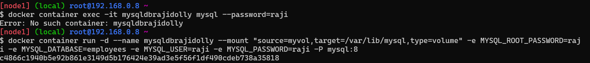
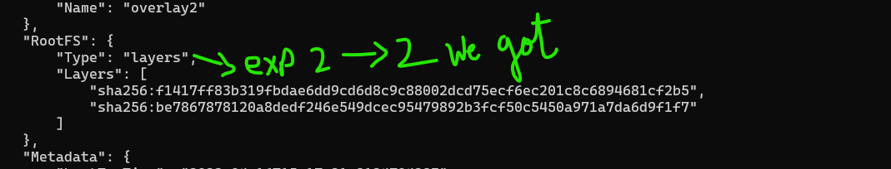

### Experiments:
------------
Create a mysql container
list all the volumes
inspect all the volumes
create volume docker volume create myvol
inspect myvol
Figure out locations of volumes in your local systems
---------------------------------------------------------------
# Get into dockerplayground
-------------------------
Now create mysql:8 use this command
------------------------------------

docker container run -d --name mysqldbrajidolly --mount "source=myvol,target=/var/lib/mysql,type=volume" -e MYSQL_ROOT_PASSWORD=raji -e MYSQL_DATABASE=employees -e MYSQL_USER=raji -e MYSQL_PASSWORD=raji -P mysql:8

$ docker image pull mysql (version its ur wish)
$ docker container ls
$ docker container exec -it mysqldbraji mysql --password=raji     
   (name password ur wish) 
mysql> use use employees;
mysql> CREATE TABLE Persons (
    ->     PersonID int,
    ->     LastName varchar(255),
    ->     FirstName varchar(255),
    ->     Address varchar(255),
    ->     City varchar(255)
    -> );

----> pass this value to it creates table 

mysql> Select * from Persons;

mysql> 

Insert into Persons Values (1,'raji','lokesh', 'raji', 'lokesh'); Insert into Persons Values (2,'raji','lokesh', 'pragathinagar', 'hyd'); Insert into Persons Values (3,'geetha','rayudu', 'pragathinagar', 'hyd');
(Names ur wish to create a table); Insert into Persons Values (4,'navya','ranganayakulu', 'banglore', 'banglore');

# Summary:
----------
First create a container then After completion of create table in Mysql database deletion container and re-create container so that u can see our table result by attaching volmue u can able to see our table 

# Alpine:
--------- 
Image Layers
-------------
A Read write layer gets added to every container and image will have read layers
Layers in Docker Image 
Lets pull alpine image and inspect the image 

docker image pull alpine

docker image inspect alpine

Experiment 1
------------

$ mkdir experimets
$ cd experiments/
create a new image based on alpine exp1

$ vi exp1
FROM alpine
label author=raji
CMD ["sleep", "1d"]

$ docker image build -t exp1 -f exp1 .

# experiment2:
--------------

$ docker image inspect exp2 

create a new image based on alpine exp2
$ echo "hello" > 1.txt

$ vi exp2 

FROM alpine
label author=khaja
ADD 1.txt /
CMD ["sleep", "1d"]

$ docker image build -t exp2 -f exp2 .

create a new image based on alpine exp3

$ vi exp3

FROM alpine
label author=khaja
RUN echo "one" > 1.txt
RUN echo "two" > 2.txt
RUN echo "three" > 3.txt
CMD ["sleep", "1d"]

$ docker image build -t exp3 -f exp3 .

# create a new image based on alpine exp4

vi exp4 

FROM alpine
label author=khaja
RUN echo "one" > 1.txt && \
    echo "two" > 2.txt && \
    echo "three" > 3.txt
CMD ["sleep", "1d"] 

$ docker image build -t exp4 -f exp4 . 
