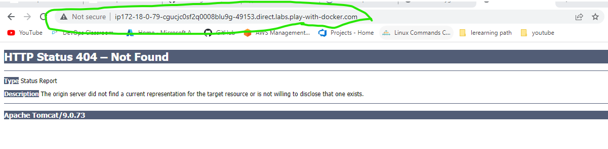
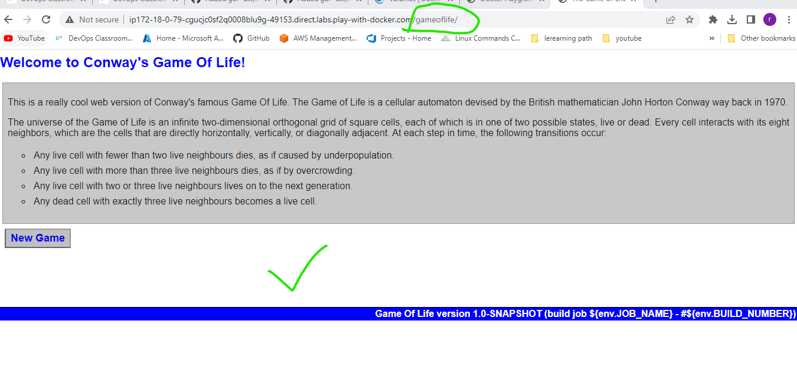

$ docker container run -it -p 35000:8080 tomcat:9-jdk8 /bin/bash
gol 
---- 
$ docker container run -it -p 35000:8080 tomcat:9-jdk8 /bin/bash
root@1a3a72b09cc1:/usr/local/tomcat# ls 
root@1a3a72b09cc1:/usr/local/tomcat# cd webapps
root@1a3a72b09cc1:/usr/local/tomcat/webapps# ls

root@1a3a72b09cc1:/usr/local/tomcat/webapps# wget https://referenceapplicationskhaja.s3.us-west-2.amazonaws.com/gameoflife.war

root@1a3a72b09cc1:/usr/local/tomcat/webapps# ls
gameoflife.war
root@1a3a72b09cc1:/usr/local/tomcat/webapps# exit 

mkdir gol 
cd gol 
vi Dockerfile

FROM tomcat9-jdk8
ADD https://referenceapplicationskhaja.s3.us-west-2.amazonaws.com/gameoflife.war /usr/local/tomcat/webapps/gameoflife.war
EXPOSE 8080 
docker image build -t gol .
$ docker container run -d -P --name gol1 gol
9044141bbc3e7998711599ad605fc3bc27f16eca42da2d78532ddf40d96436bd

Now you can check the image of gol in dockerplayground port

