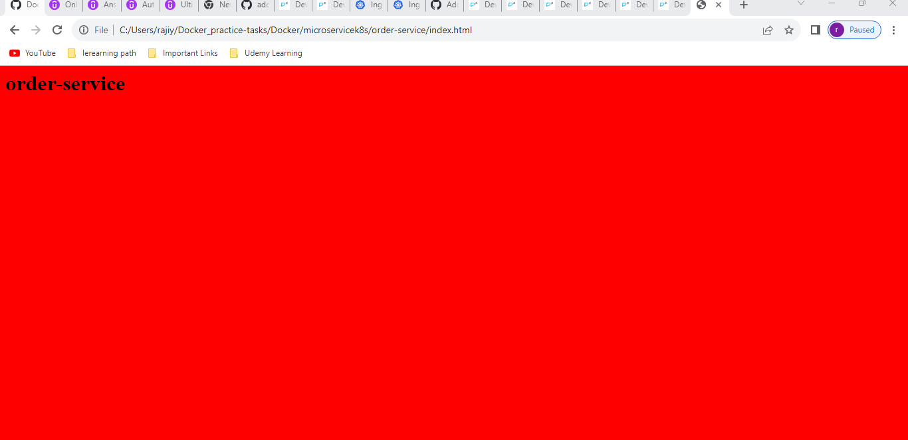
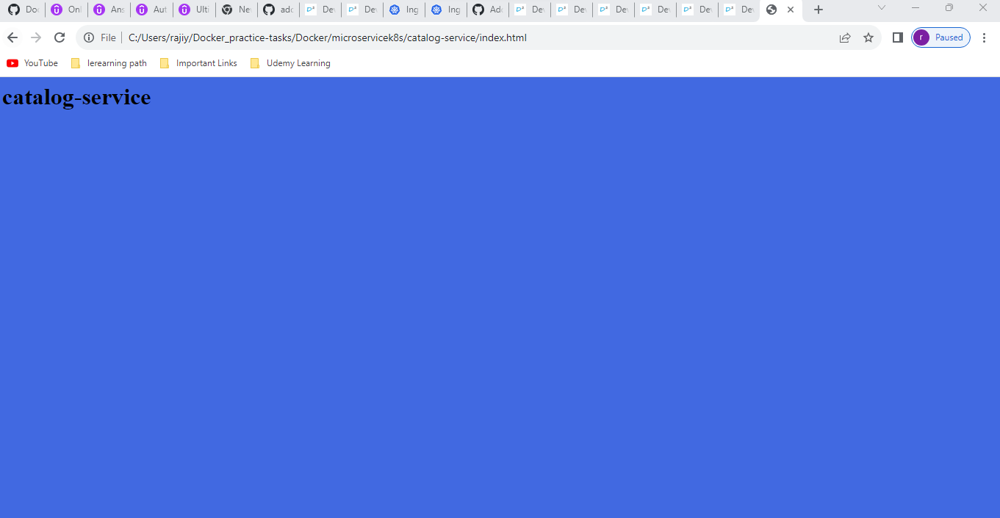
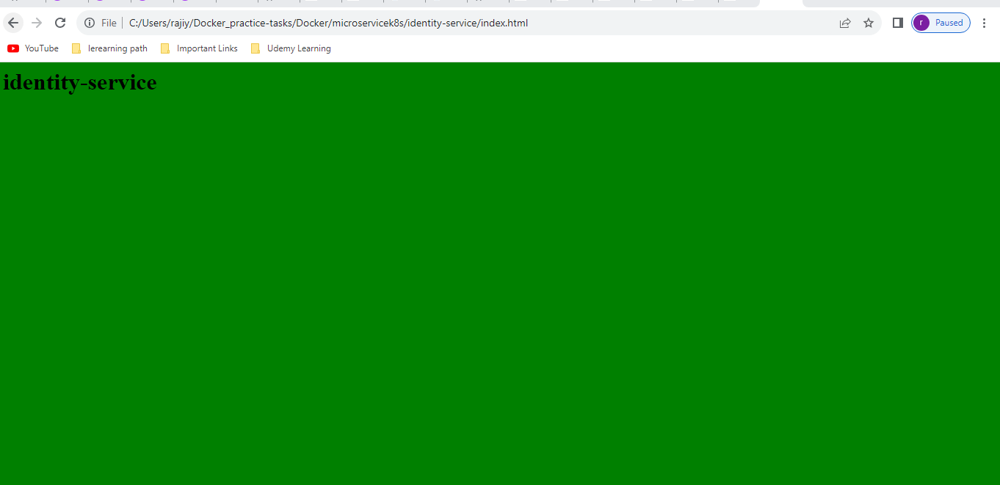

### microservicek8s
--------------------
# ingress 
----------
What is Ingress?
Ingress exposes HTTP and HTTPS routes from outside the cluster to services within the cluster. Traffic routing is controlled by rules defined on the Ingress resource.

Here is a simple example where an Ingress sends all its traffic to one Service:
ls

Now create the Micro services:
-------------------------------
* basket-services
  
* order-service
 
* catalog-service
  
* identity-service
 